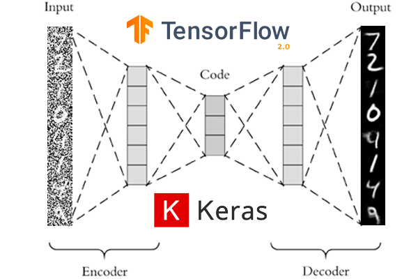
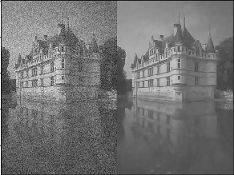
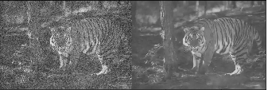
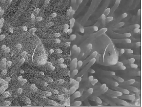
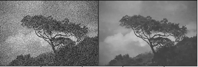
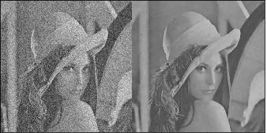
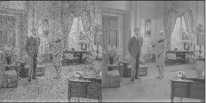

# Denoising Autoencoder

An autoencoder is a type of artificial neural network used to learn efficient data codings in an unsupervised manner. The aim of an autoencoder is to learn a representation (encoding) for a set of data, typically for dimensionality reduction, by training the network to ignore signal “noise”.

Denoising autoencoder is a stochastic extension to classic autoencoder , that is we force the model to learn reconstruction of input given its noisy version. A stochastic corruption process randomly sets some of the inputs to zero, forcing denoising autoencoder to predict missing(corrupted) values for randomly selected subsets of missing patterns.

### Input and Output image samples

